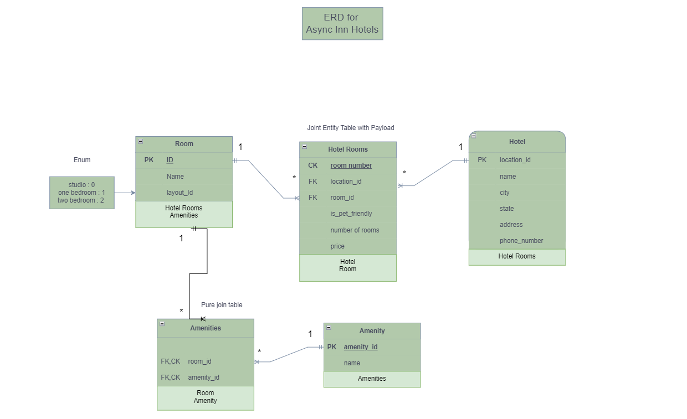
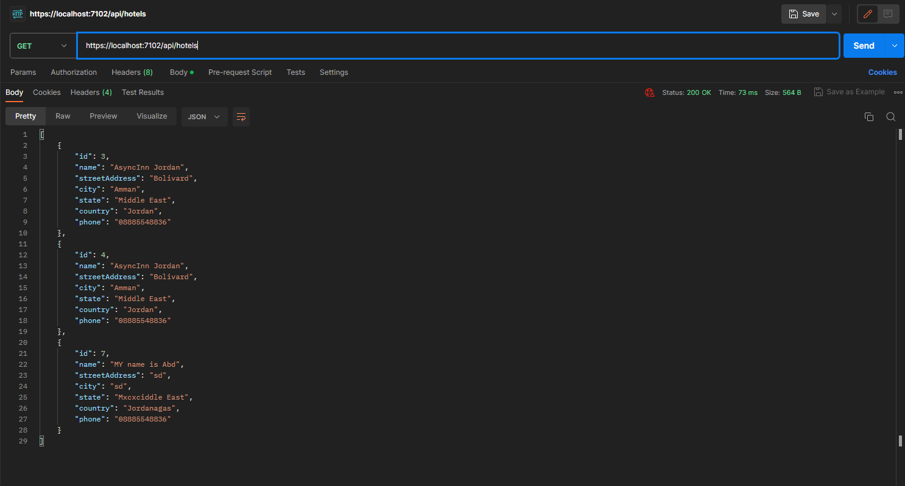

# As7ync-Inn

## Abdallah ALomari 16/7/2023 

- ### Hotel table :

     Hotel table has a location id which is primary key which means it is only up for a hotel
     because we don't have  two hotels with the same location id.
     and it is also had a name,city,state...etc.
     and each hotel has a many rooms and it is connected with hotel rooms table.

- ### Room table : 

    
    Room table has a room id which is a primary key and  the room has a relationship with two tables 
    it is many to many with hotel because each many hotels have many room and many rooms are find in many hotels so it is many to many relationship
    and many to many with Amenty because many rooms can have a many of amenity and many amenity can be assign for many rooms 
    and it is connected with amenities table.

- ### Amenity table:

    
    Amenity table has a primary key amenity id and name attribute and the Amenity table has a relation with room 
    and it is many to many multy or many amenity can be inside many rooms.
    and it is connected with amenities table

- ### Hotel rooms table:

    
    Hotel room is a Joint entity table with payload between two tables and it is many to one with hotel and many to one with Room
    so in each Hotel we have an unique number of room number and it is composite key between the room id and hotel location id
    so lets explain the data flow here: this means a unique number of a room can be found in multiple hotels so like a room with number 23 can be found in many locations 
    and it has a payload attributes like a price an is pet friendly  room and number of rooms inside this location hotel.
    We can say a room in paris cost per night around 300$ while the same room in other location can be cost only 200$.

- ### Amenities table: 
    
  this is a pure join table with Composite key the amenity id and the room id, 
  so lets explain the data flow here, this each room can have multi amenity but cann't take duplicated amenity
  you can't find a room with two coffe maker for example, and many amenity can belong to single room. 

--- 
- ## Lab13 InterFaces and DI

    - I created a Three interfaces for the modals that i have, Also i created a CRUD methods for all of them inside the interface.
    i also craeted 3 services as the models name and inherited each service with own interface and cmpleted the implemnation for the 
    interface inside the services classes. 
    once i finished i edited the controllers that i have from lab 12 to take a interface insted of the Datacontext 
    and i tested the data through the `postman` and it is working well i can Do CRUD Clearly. 

    - 

- ## Lab 14  Navigation Properites 

    - i create a new 2 models which calls the jont entity table as you see in my ERD picture there 
    is a many to many between `(Hotels,Rooms)` and we created a joint entity table model which calls a HotelRooms
    and also we have a many to many between the `(Rooms,Amenity)` and we created a join pure table which calls 
    RoomAmenities

    - DataContext 
    we modifeid it to add the new modles which is the RoomAmeneiteis and the HotelRooms 
    and also we added the keys for each table 

    - `Room`
    inside the Room i modefied it and added a Navigation properties to take a list of room amenities 
    and to take a list of HotelRooms 

    - `Hotel`
    inside the Hotel we make also a list of the HotelRoom model to show all of the room that was inside the Hotel

    - `Amenity` 
    i created a list of room amenities inside it to get all the amenitis that was inside one room

   - ### the Lazy loading and Eager Loading 
       in the GET request i edited the whole Gets methods to use Eager Loading and including the new navigation Properites in the json 

- # Lab 16 DTO 

    - I created A DTO classes for All Models without the RoomAmenities model 
        and i edited the whole CRUD operations for all Services i have before to use the New DTO 
        Models.

    - Also Created a new DTO that's wasn't from the guidence of the lab 
    which calls Add new Room, I Created this DTO to handle the Adding room insted of adding a list of Amenity 
    or avoid any errors, i can add an amenity by id to the room from the post and because there is no room without 
    the amenity so we can say it is required for the room.

    - That's what i made so far so the summary : 
        - now when i make a get Hotel I will get the hotelRoom from it and inside the HotelRoom
        i have an Room that will be inside the Hotel and each room has own details with amenity and so one
        and from the hotel room we gonna see the room details 

        - and from the room the json will provide for me the Room detailes which is the amenity that rooms has 
        
        - and finally  we can get the ameniteis or any specific amenity that we want 